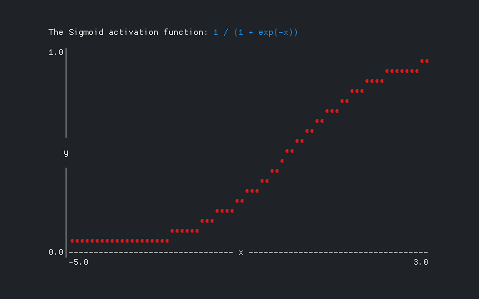

# SWISH

The SWISH activation function ([Ramachandran, Zoph and Le, 2017](https://arxiv.org/abs/1710.05941)), for neural networks.

Output from the graph example in `cmd/graph`:

The graphs are drawn using [goterm](https://github.com/buger/goterm).

---

Alexander F. Rødseth &lt;xyproto@archlinux.org&gt;
