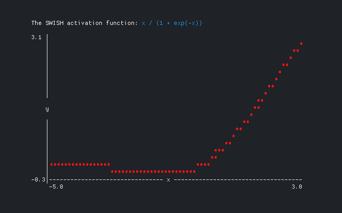

# swish

The SWISH activation function ([Ramachandran, Zoph and Le, 2017](https://arxiv.org/abs/1710.05941), for neural networks.

Output from the graph example in `cmd/graph`:

Alexander F. Rødseth &lt;xyproto@archlinux.org&gt;
